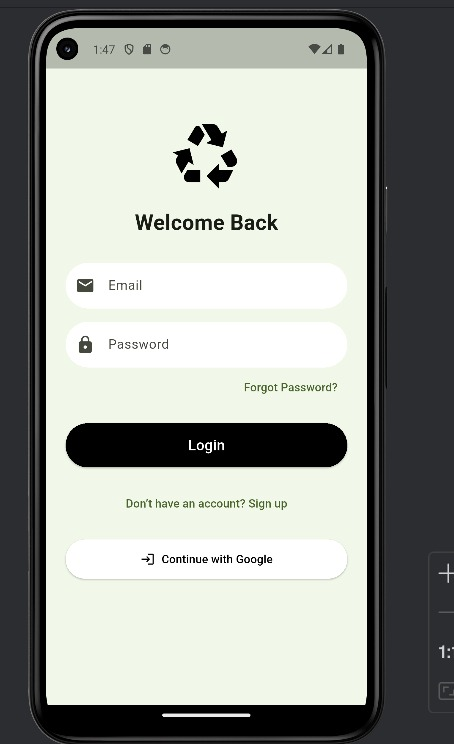
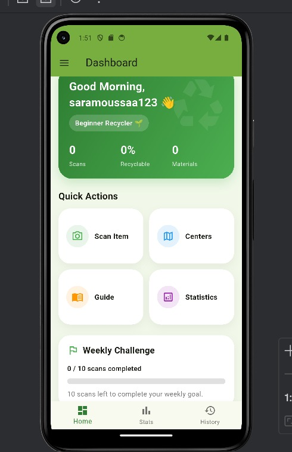
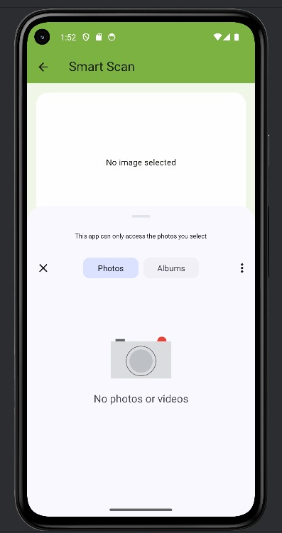
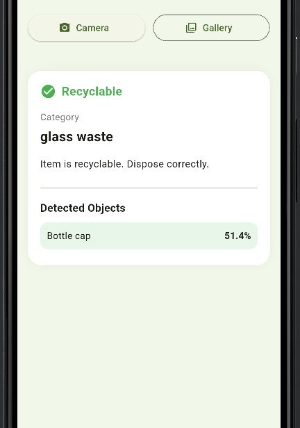
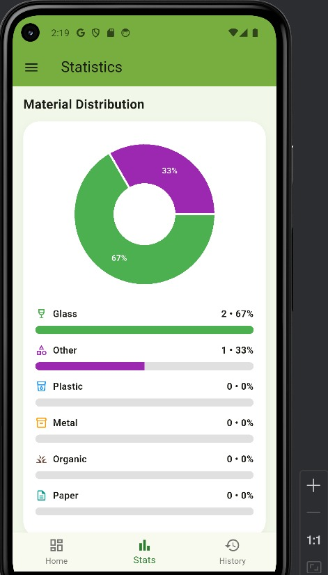
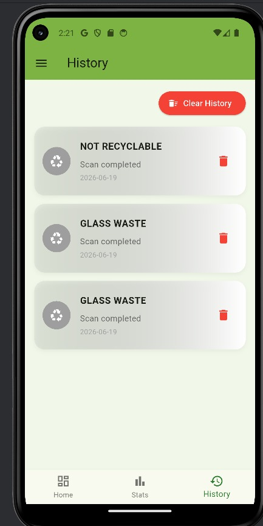

# Smart Pre-Recycling: A Multi-Model AI System for Intelligent Waste Classification

## Overview

Smart Pre-Recycling is an AI-powered mobile application designed to improve waste sorting and recycling awareness through intelligent image analysis. The system combines deep learning, mobile computing, and cloud technologies to help users identify waste items, determine recyclability, classify waste materials, and detect specific waste objects before disposal.

The solution follows a client-server architecture where a Flutter mobile application communicates with a Python-based backend through REST APIs. The backend utilizes a three-stage AI pipeline consisting of EfficientNet-B0, EfficientNet-B4, and YOLOv8s to provide comprehensive waste analysis.

---

## Team Members

| Name                   | Student ID | Program |
| ---------------------- | ---------- | ------- |
| Salma Ramy Ziada       | 202201759  | DSAI    |
| Shahd Tarek Abdelhamid | 202202263  | DSAI    |
| Sandy Mohamed Hassan   | 202202034  | SWD     |
| Sara Ehab Yehia        | 202202146  | DSAI    |

### Supervisor

Dr. Mohamed Maher Atta

Associate Professor, School of Computational Sciences and Artificial Intelligence (CSAI), Zewail City of Science and Technology

---

## Problem Statement

Improper waste sorting remains one of the major challenges in modern waste management systems. Many individuals struggle to distinguish between recyclable and non-recyclable waste, leading to contamination of recycling streams and reduced recycling efficiency.

Smart Pre-Recycling addresses this problem by providing an intelligent mobile-based assistant capable of automatically analyzing waste images and providing detailed recycling guidance through deep learning models.

---

## Key Features

### AI-Powered Waste Analysis

* Recyclable vs. Unrecyclable Classification
* Multi-Class Waste Material Classification
* Waste Object Detection and Subclassification
* Confidence Score Visualization

### User Management

* Email & Password Authentication
* Google Sign-In
* Secure Firebase Authentication

### Smart Recycling Features

* Smart Waste Scanning
* Scan History Tracking
* Personal Recycling Statistics
* Recycling Progress Dashboard
* Weekly Recycling Challenges
* Recycling Guide

### Data Management

* Cloud Firestore Integration
* User Scan History Storage
* Statistics Generation
* Profile Management

### Deployment Features

* REST API Communication
* Docker Support
* Containerized Backend Deployment

---

## System Architecture

The system follows a client-server architecture:

```text
Flutter Mobile App
        │
        ▼
 REST API Communication
        │
        ▼
 Python FastAPI Backend
        │
 ┌──────┼──────────┐
 ▼      ▼          ▼
EfficientNetB0  EfficientNetB4  YOLOv8s
        │
        ▼
 Firebase Firestore
        │
 Firebase Authentication
```

---

## AI Pipeline

### Stage 1: Recyclability Classification

Model: EfficientNet-B0

Purpose:

* Determine whether waste is recyclable or unrecyclable.

Performance:

* Accuracy: 94.19%

---

### Stage 2: Material Classification

Model: EfficientNet-B4

Purpose:

* Classify recyclable waste into nine material categories.

Categories:

* Plastic Waste
* Paper Waste
* Glass Waste
* Metal Waste
* Organic Waste
* Battery Waste
* E-Waste
* Automobile Waste
* Light Bulbs

Performance:

* Accuracy: 90.51%
* Macro F1-Score: 0.91

---

### Stage 3: Waste Object Detection

Model: YOLOv8s

Purpose:

* Detect waste objects and perform fine-grained subclassification.

Performance:

* Precision: 85.9%
* mAP@50: 71.1%

---

## Technology Stack

### Frontend

* Flutter
* Dart

### Backend

* Python
* FastAPI
* Uvicorn

### AI & Machine Learning

* TensorFlow
* Keras
* EfficientNet
* YOLOv8
* OpenCV
* NumPy
* Pandas

### Cloud Services

* Firebase Authentication
* Cloud Firestore

### Deployment

* Docker
* Dockerfile
* Docker Compose Ready

### Development Tools

* Visual Studio Code
* Android Studio
* Google Colab
* Git
* GitHub

---

## Project Structure

```text
Smart-Pre-Recycling-App
│
├── smart_pre_recycling_backend/
│   ├── app/
│   ├── models/
│   ├── uploads/
│   ├── Dockerfile
│   └── requirements.txt
│
├── lib/
│   ├── screens/
│   ├── services/
│   ├── widgets/
│   └── models/
│
├── assets/
├── README.md
└── pubspec.yaml
```

---

## Setup Instructions

### Prerequisites

* Flutter SDK
* Python 3.10+
* Git
* Firebase Project Configuration

---

### Clone Repository

```bash
git clone https://github.com/Sandymohamed12/Smart-Pre-Recycling-App.git
cd Smart-Pre-Recycling-App
```

---

## Backend Setup

Navigate to the backend directory:

```bash
cd smart_pre_recycling_backend
```

Install dependencies:

```bash
pip install -r requirements.txt
```

Run the backend:

```bash
uvicorn app.main:app --reload
```

The backend will be available at:

```text
http://127.0.0.1:8000
```

---

## Frontend Setup

Open a new terminal from the project root:

```bash
flutter pub get
```

Run the Flutter application:

```bash
flutter run -d chrome
```

---

## Docker Deployment

Navigate to the backend folder:

```bash
cd smart_pre_recycling_backend
```

Build Docker image:

```bash
docker build -t smart-pre-recycling .
```

Run container:

```bash
docker run -p 8000:8000 smart-pre-recycling
```

---

## Usage Guide

### 1. Login or Register

Users can create an account using email/password authentication or Google Sign-In.

### 2. Scan Waste

Capture a photo using the camera or upload an image from the gallery.

### 3. AI Analysis

The image is analyzed using the three-stage AI pipeline.

### 4. View Results

The application displays:

* Recyclability Status
* Waste Category
* Confidence Scores
* Detected Waste Objects

### 5. Track Progress

Users can view:

* Scan History
* Recycling Statistics
* Weekly Challenges
* Recycling Progress

---

## Screenshots

### Login Screen



### Dashboard



### Smart Scan



### Prediction Results



### Statistics Dashboard



### Scan History



---

## Future Work

Future enhancements include:

* Smart Recycling Bin Hardware Prototype
* Conveyor Belt Waste Sorting System
* Cloud Deployment on AWS, Azure, or Google Cloud
* Real-Time Waste Monitoring
* Recycling Facility Mapping
* AI Recycling Assistant Chatbot
* Edge AI Deployment
* Multi-Language Support

---

## Repository

GitHub Repository:

https://github.com/Sandymohamed12/Smart-Pre-Recycling-App

---

## License

This project was developed as a Graduation Project at Zewail City of Science and Technology, School of Computational Sciences and Artificial Intelligence (CSAI).
